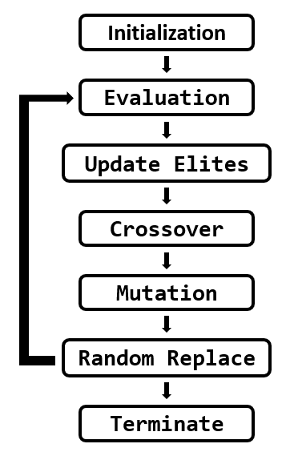

# OhMyGene

OhMyGene is a tiny framework for multiple objective optimization genetic algorithm.

Multi-objective formulations are realistic models for many complex engineering optimization problems.
Objectives under consideration usually conflict with each other.
A Pareto optimal set is a set of solutions that are non-dominated with respect to each other. We can use multi-objective GA to get a Pareto optimal set with good solutions.

GA is inspired by evolutionary theory. In GA terminology, a solution vector is called an individual or a chromosome, which normally corresponds to a unique solution in the solution space.
GA operates with a collection of chromosomes, called a population, the population is normally randomly initialized.
As the search evolves, the population includes fitter solutions, and eventually, it converges.

OhMyGene adopts random weights genetic algorithm, which is simple to implement. The general flow is shown below.

## Prospective Users
OMG targets users who need to solve multi-objective problems in specific fields. Users have to map the solution spaces of the problems into forms of chromosomes supported by OMG.

After the encoding of a problem, the general GA can be adapted to solve the transformed problem by tuning some parameters. E.g., generation number, mutation probability, fitness function choice, parent selection method, cross-over method, mutation method, etc.
After the selection of parameters, OMG automatically creates an object of GA and runs it. The result will be shown on the screen for inspection after GA stops.

Users can try out different parameter combinations to get the best version of GA that fits their needs by simply altering a few lines of Python code, OMG!

## System Architecture
**Tunable Parameters**  
(See the comments in `omg\rum.py` for more details)
1. gene count (no default)  
2. gene bound (no default)  
3. generation count (default = 100)  
4. population size (default = gene_count * 10)  
5. mutation probability (default = 0.01)  
6. cross over method (default = single point crossover)  

**System Components**
1. **Parser**: Python class. Checks the validity of input parameters and performs necessary transformations.
2. **GA Wrapper**: Python class. Wrapper class for underlying C++ GA class.
3. **Result**: Python class. Contain results returned from GA wrapper.
4. **Printer**: Python class initialized with Result. Responsible for printing the results in specified forms.
5. **GA**: C++ class. Perform GA configured with parameters processed by Parser.

## Getting Started
### Dependency
#### Python3 packages required:
matplotlib
#### C++ library required:
pybind11

### How to Run GA
step1. Add objective functions in `src/obj_funcs.cpp`.  
step2. Modify `args` in `omg\run.py`.  
step3. Enter `make && make run` in terminal. (`make` is required only if `obj_funcs.cpp` or `THRESHOLD` is modified)  
step4. Fitness value and solutions of Elites will be printed on terminal and a graph with fitness value of each generation will be shown.  
**Note:** `THRESHOLD` in `include/GA.hpp` determines the precision of the fitness value. You can dig into `void GA::updateElites()` in `src/GA.cpp` for more details.  

## References
[1] https://www.eng.auburn.edu/~aesmith/files/Multi-objective%20optimization%20using%20genetic%20algorithms.pdf  
[2] https://github.com/ahmedfgad/GeneticAlgorithmPython  
[3] https://www.researchgate.net/figure/General-flow-chart-for-GA_fig1_337199672  
[4] https://pybind11.readthedocs.io/en/stable/classes.html  
